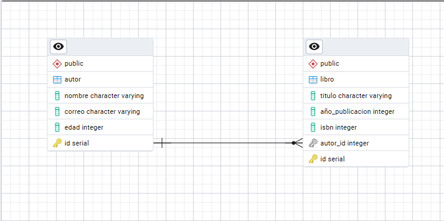

# Prueba técnica desarrollador backend python 

**Julian Andres Montoya Carvajal C.C 1214727927**

## Parte 1: Instrucciones de instalacion y ejecucion

* Preferiblemente tener instalado Ubuntu 22.04.3 LTS (Jammy) (Windows tambien se puede pero debe poder instalar docker y docker compose).

* Asegurate de instalar Docker version 24.0.7 y ademas Docker Compose version 2.21.0. El siguiente link te puede ayudar a obtener los dos https://www.digitalocean.com/community/tutorials/how-to-install-and-use-docker-on-ubuntu-22-04

* Clone el repositorio con los siguientes comandos (debe tener instalado git)

```bash
git clone https://github.com/andresprogramacion123/prueba_backend_manpower.git
```

* Ingresa a la carpeta donde esta el proyecto

```bash
cd prueba_backend_manpower
```

* Crea el archivo .env con las variables de entorno correspondientes, para tener un ejemplo puede ver el archivo adjunto en el proyecto llamado .env_example

* Posteriomente ejecute el archivo docker-compose.yml para ejecutar el proyecto

```bash
sudo docker compose up --build
```

* Visita http://localhost:5000/ en tu navegador para acceder a la aplicacion

* Visita http://localhost:5000/docs en tu navegador para acceder a la documentación interactiva de la API generada automáticamente por FastAPI.

* Visita http://localhost:5050/ en tu navegador para acceder a la interfaz grafica de la base de datos postgresql.

**Nota:** En caso de tener problemas con puertos ya utilizados, ejecutar comando siguiente para conocer el ID del contenedor

```bash
sudo docker ps
```

Luego detener el contenedor con el siguiente comando

```bash
sudo docker stop ID_CONTENEDOR
```

* Para generar pruebas unitarias y covertura y reporte de cobertura (Ingresar primero al contenedor de la API y ejecutar los comandos):

```bash
export PYTHONDONTWRITEBYTECODE=1 && coverage run -m pytest
```

```bash
export PYTHONDONTWRITEBYTECODE=1 && coverage report
```

## Parte 2: Estructura del proyecto y esquema relacional

```bash
├── Dockerfile
├── README.md
├── app
│   ├── __init__.py
│   ├── config
│   │   ├── __init__.py
│   │   └── config.py
│   ├── crud
│   │   ├── __init__.py
│   │   ├── autor.py
│   │   └── libro.py
│   ├── database
│   │   ├── __init__.py
│   │   └── session.py
│   ├── dependencies.py
│   ├── main.py
│   ├── models
│   │   ├── __init__.py
│   │   ├── autor_model.py
│   │   └── libro_model.py
│   ├── prestart.sh
│   ├── routers
│   │   ├── __init__.py
│   │   ├── autor.py
│   │   └── libro.py
│   ├── schemas
│   │   ├── __init__.py
│   │   ├── autor.py
│   │   └── libro.py
│   ├── security
│   │   ├── __init__.py
│   │   └── security.py
│   ├── services
│   │   ├── __init__.py
│   │   ├── _base.py
│   │   ├── autor.py
│   │   └── libro.py
│   ├── tests
│   │   ├── __init__.py
│   │   ├── test_api.py
│   │   └── test_main.py
│   └── utils
│       ├── __init__.py
│       ├── exceptions.py
│       └── service_result.py
├── docker-compose.yml
├── env
│   ├── bin
│   ...
├── esquema_datos.png
├── htmlcov
│   ├── class_index.html
│   ...
└── requirements.txt
```



### Flujo de backend 

1) schemas: Construimos schemas pydantic con las validaciones respectivas para cada campo. 
    * Establecemos tipos de campos (str, int, float, date o datetime, bool, categorico, email, dict, JSON, etc..)
    * Establecemos si los campos son Obligatorios u Opcionales
    * Establecemos si el campo es unico o no
    * Establecemos el esquema base (Base), 
    * El esquema para base de datos si es necesario (InDB)
    * El esquema para crear o registrar (Created)
    * El esquema para leer (Read)
    * El esquema para leer con relaciones de otros modelos si es necesariio (ReadWith)
    * El esquema para actualizar un registro si es necesario (Updated).

2) models: Construimos modelo de base de datos. 
    * Establecemos el modelo (Tabla) que se creara en la base de datos.
    * Inicialmente para verificar que se cree bien lo creamos sin claves foraneas, sin atributos relationship y sin restricciones
    * Posteriormemente cuando verificamos que se creo bien establecemos relaciones de claves foraneas, atributos de relationship y restricciones si es necesario.

3) database: Importamos en modelo de base de datos en el modulo database.session

4) crud: Establecemos las funciones del crud para crear, leer, actualizar y eliminar un registro

5) utils/exceptions: Establecemos las excepciones en los servicios.

6) services: Construimos los servicios con su logica determinada y excepciones

7) routers: Establecemos los endpoints

8) main: Importamos en router

El desarrollo anterior tiene una arquitectura de tres capas

1) Capa de controladores o routers (endpoints): Se encuentra en app/routers/ modifique o agregue los endpoints que desea

2) Capa de servicios o logica del negocio: Se encuentra en app/services/ modifique o agregue los servicios y la logica que desea 

3) Capa de acceso a datos y operaciones crud: Se encuentra en app/crud/ modifique o agregue las operaciones crud y las consultas segun su necesidad

## Parte 3: Preguntas adicionales

* ¿Cómo manejarías la autenticación y autorización en la API?

Para manejar la autenticacion añadiria a la API un servicio de usuarios que permita registrar los usuarios y guardar sus contraseñas hasheadas. Utilizaria JWT para generar un token de acceso para la API con un tiempo determinado de expiracion corto. añadiria un enpoint encargado de generar los token de acceso. Para el caso de la autorizacion utilizaria la inyeccion de dependencias que maneja FastAPI, y utilizaria roles y campo de usuario-activo para manejar la autorizacion en los diferentes endpoints de la API.

* ¿Qué estrategias utilizarías para escalar la aplicación?

Para escalar la aplicacion utilizaria alembic para las migraciones de base de datos con postgresql.
Añadiria servicio de autenticacion y autorizacion para modelo de usuarios. Estableceria una relacion diferente entre los libros y los autores de manera que un autor pueda tener varios libros pero tambien un libro pueda tener varios autores. 

Dividiría la aplicación en microservicios según las responsabilidades (por ejemplo, un servicio para la gestión de libros y otro para la gestión de usuarios) para mejorar la mantenibilidad y facilitar el escalado independiente de componentes.

* ¿Cómo implementarías la paginación en los endpoints que devuelven listas de libros?

Para implementar la paginación en los endpoints que devuelven listas de libros, utilizaría los parámetros de consulta offset y limit. A continuación, explico cómo funciona este enfoque (Ver endpoint en API):

Usar de offset y limit: 
limit: Define cuántos registros (libros) se deben devolver por solicitud. Esto ayuda a limitar el número de resultados que el cliente recibe, mejorando el rendimiento y la experiencia de usuario.
offset: Define el punto de inicio desde donde se deben obtener los registros. Esto permite al cliente avanzar a través de las páginas de resultados.

Es útil devolver información adicional como el total de libros disponibles, el número de páginas, o si hay más páginas disponibles. Esto puede mejorar la experiencia de usuario al navegar por los resultados.

* ¿Cómo asegurarías la seguridad de la aplicación (protección contra inyecciones SQL, XSS, etc.)?

Protección contra inyecciones SQL: Al usar un ORM como SQLModel, ya se mitigan los riesgos de inyecciones SQL, porque las consultas se generan automáticamente con parámetros seguros. Sin embargo, es importante validar y sanitizar cualquier entrada del usuario y asegurarse de que los datos se manejen adecuadamente sin ejecutar consultas SQL sin procesar.

Protección contra Cross-Site Scripting (XSS): Sanitizar y escapar las entradas de los usuarios antes de mostrarlas en las respuestas HTML. Usar encabezados HTTP de seguridad, como Content-Security-Policy, para restringir las fuentes de scripts y prevenir la ejecución de scripts no confiables. En caso de usar plantillas, asegurar que las bibliotecas de plantillas utilizadas manejen el escape de HTML por defecto.

Protección contra ataques de Cross-Site Request Forgery (CSRF): Implementar tokens CSRF en las solicitudes que modifiquen el estado del servidor, especialmente si hay formularios o interfaces web involucradas. Asegurarse de que las sesiones sean seguras y no se reutilicen indebidamente.

Cifrado de datos sensibles: Usar HTTPS para cifrar las comunicaciones entre el cliente y el servidor.
Almacenar contraseñas de manera segura utilizando algoritmos de hashing como bcrypt.
Evitar almacenar información sensible sin cifrar en la base de datos.

Validación de datos: Utilizar las capacidades de validación de FastAPI con Pydantic para asegurarse de que solo se procesen datos válidos y con el formato esperado.
Aplicar validaciones adicionales para entradas que requieran un formato específico o que deban cumplir con criterios de negocio.

Gestión adecuada de encabezados de seguridad: Configurar encabezados de seguridad HTTP como Strict-Transport-Security, X-Content-Type-Options, X-Frame-Options, Referrer-Policy, y Permissions-Policy para proteger la aplicación de diversas amenazas basadas en la web.